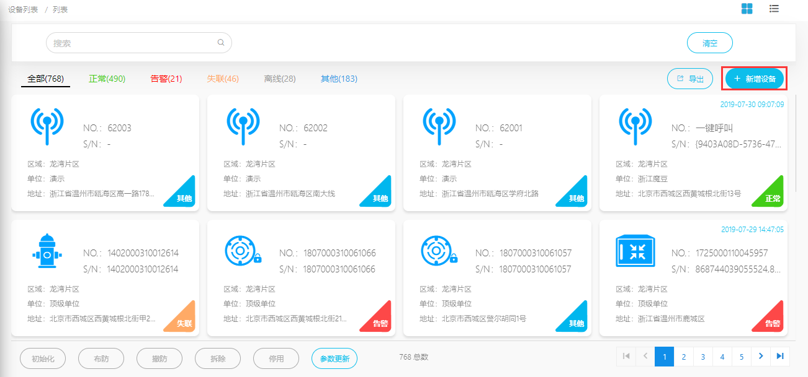
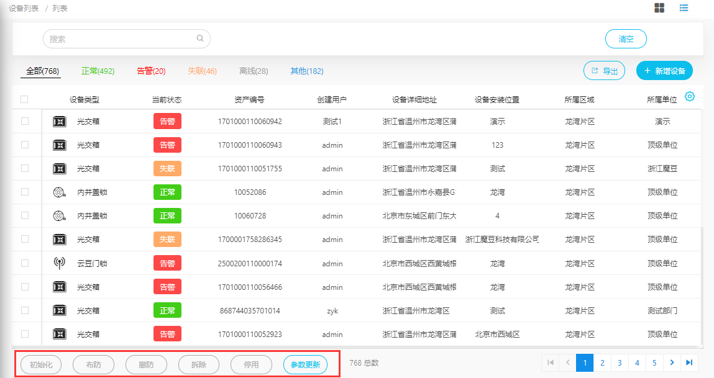
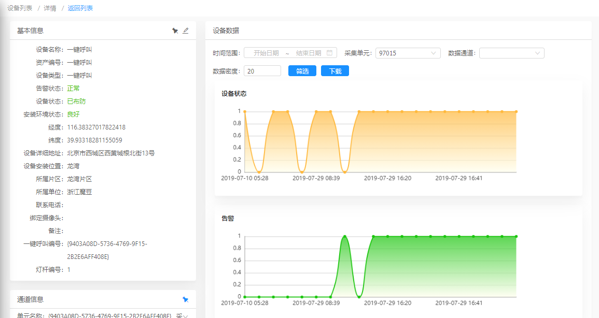
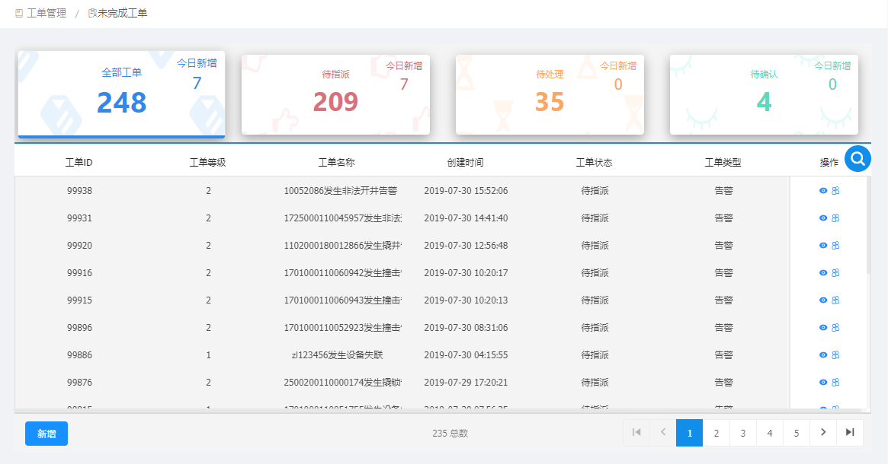
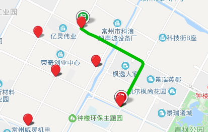
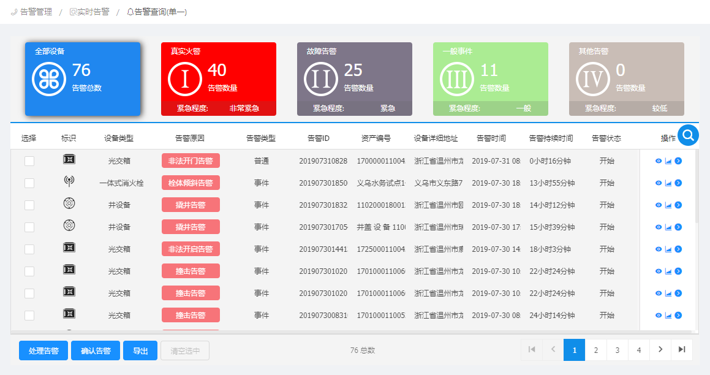
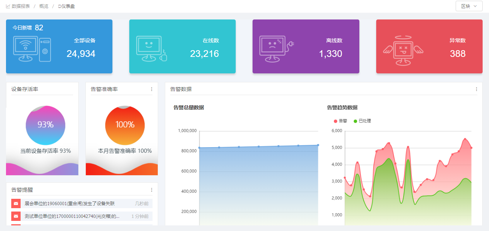
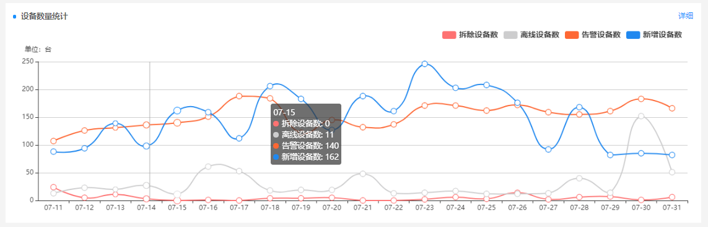
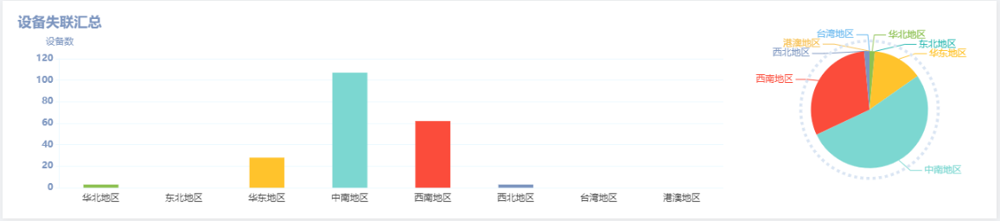
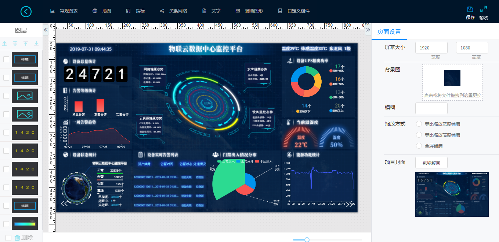

# 物联云平台功能介绍
## 一、设备管理
### 1.1 设备的报装、重装

设备管理功能中，通过“新增设备”按钮可以增加新的终端设备。不同类型的设备，需要填写的信息有一定的区别。在平台接收到报装设备的第一次心跳（数据上报）后，设备将进入正常的工作状态（布防状态）。

如果在报装时填写了错误的设备信息，可以对设备信息重新编辑后再次报装（重装）。
### 1.2 设备的基本操作

- **停用**：通过停用功能，可以暂时停止系统对设备进行监控。停用后可通过布防操作来恢复。
- **拆除**：设备因故障或其他原因不再使用时，可通过此功能删除设备。
- **布防、撤防**：设备在维护，检修时，为了防止设备在维护过程触动设备频繁发生告警，可在维护前对设备进行撤防操作。
- **参数更新**：用于下发终端的配置参数。
- **初始化**：恢复硬件设备的默认配置参数。

### 1.3 设备详情

终端设备信息包含基本信息与通道信息。

- **基本信息**：设备报装时录入的信息。
- **通道信息**：设备心跳时上报的数据，支持历史趋势查询。

### 1.4 远程控制
对于路灯、锁一类的可控制终端，平台支持远程控制开关。
## 二、设备维护
### 2.1 任务工单

平台中的告警处理、维护等操作均是通过工单的形式来完成。工单主要分为两种类型：

- **告警工单**：设备发生告警时，系统将自动创建一条告警处理工单。
- **自定义工单**：用户自行创建的工单。

工单的处理流程：

**创建 -> 指派 -> 处理 -> 驳回 -> 处理 -> 确认 -> 完成**

其中告警工单可由系统自动进行指派。

### 2.2 设备巡检
对于存在巡检需求的终端，例如井盖、消防设备。系统提供巡检任务功能，并记录巡检轨迹和巡检设备信息。

## 三、监控告警
### 3.1 告警通知

　　　　　　　　　　　　

系统支持多种方式进行告警通知，常用的有APP通知，短信通知。
对于时效性要求较高的告警，可以选择电话语音通知。
如果用户关注公众号，还可以获得微信告警通知。

### 3.2 查看告警设备

在告警管理中可以查看到所有当前正在发生告警的设备。

### 3.3 告警处理
平台默认以工单的方式进行告警处理，当设备发生告警时，系统会给设备负责人指派一条告警工单。在工单处理完成，通过审核人员确认后，告警处理才算完成。

平台还增加了普通事件的处理，当发生此类事件只需要通知当事人，而不需要做出具体的处理动作时，可以直接在查看告警时进行确认。

### 3.4 历史告警
系统将所有已经结束的告警转移到历史告警中，通过累积的历史告警数据，可以进行告警数据的分析统计。

## 四、数据分析
### 4.1 统计分析报表
平台提供了很多常用的统计分析图表，包含设备信息，告警信息，工单信息。

### 4.2 可视化大屏

平台提供了自定义的可视化大屏功能，包含多种模板，图表，组件。用户可根据自身需求，将系统数据通过大屏的形式进行呈现。
